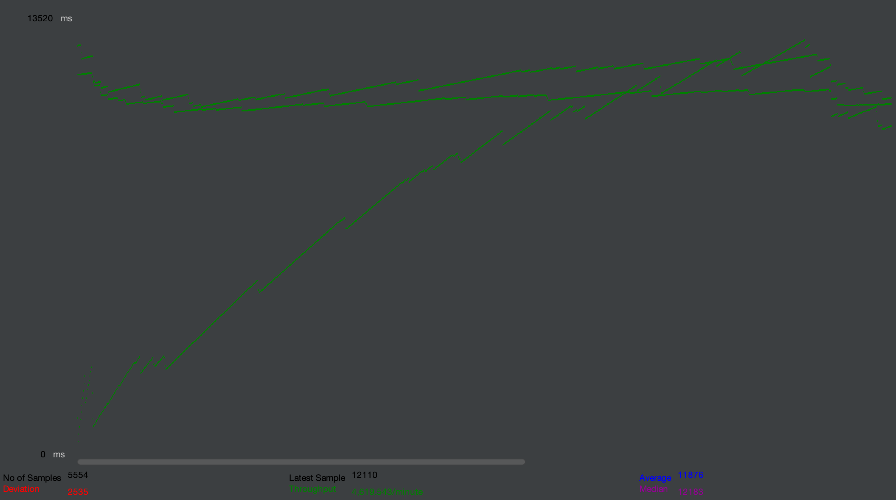
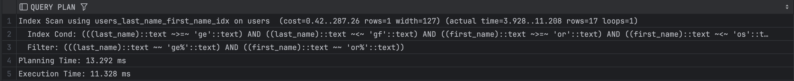

# Влияние индексов на производительсность

## Условия

Реализовать функционал поиска анкет по префиксу имени и фамилии (одновременно) в вашей социальной сети.
Провести нагрузочные тесты этого метода. Поиграть с количеством одновременных запросов. 1/10/100/1000.

- Тестируется маршрут ``/api/users/search?first_name=al&last_name=doe``
- В базе 1000000 пользователей
- Тестирование проводится 1 минуту
- POSTGRES max_connections=100
- Железо: Macbook Air M3 16GB

### Результаты без индексов

|            | 1         | 10         | 100         | 1000         |
|------------|-----------|------------|-------------|--------------|
| Latency    | P95:73 ms | P95:324 ms | P95:3210 ms | P95:50112 ms |
| Throughput | 17 rps    | 45 rps     | 47 rps      | 25 rps       |

---

#### Одновременно 1 запрос


---
#### Одновременно 10 запросов


---
#### Одновременно 100 запросов


---
#### Одновременно 1000 запросов


---

### Результаты с индексами

|            | 1         | 10         | 100         | 1000         |
|------------|-----------|------------|-------------|--------------|
| Latency    | P95: 36ms | P95: 463ms | P95: 1576ms | P95: 15127ms |
| Throughput | 39 rps    | 30 rps     | 116 rps     | 77 rps       |

---

#### Одновременно 1 запрос


---
#### Одновременно 10 запросов


---
#### Одновременно 100 запросов


---
#### Одновременно 1000 запросов


---

### Запрос на добавление индесов

```sql
CREATE INDEX users_last_name_first_name_idx ON users (last_name text_pattern_ops, first_name text_pattern_ops);
```

### Explain запросов после индекса

```sql
EXPLAIN ANALYZE
SELECT id, email, password, first_name, last_name, date_of_birth, gender, interests, city, created_at, updated_at FROM users WHERE last_name LIKE 'ge%' and first_name LIKE 'or%';
```

Результат:



### Выводы

Был выбран составной индекс, так как запрос имеет формат (WHERE … AND …).

В синтетических условиях порядок полей не так важен, но в реальности вероятно, что поле last_name будет более уникальным, чем first_name, поэтому его стоит указывать первым.

В тестах, проведённых в JMeter, нет большого разрыва в производительности, потому что:

- Отсутствие охлаждения процессора (Air M3) вносит искажения в результаты;
- Необходимо дополнительно конфигурировать базу данных и проект в целом.

Однако, даже в таких условиях, индексы показывают себя кратно лучше.

Если посмотреть на обычное время выполнения одного запроса в клиенте БД (без нагрузочного тестирования), то можно получить:
150-180 мс без индексов и 5-10 мс с индексами.