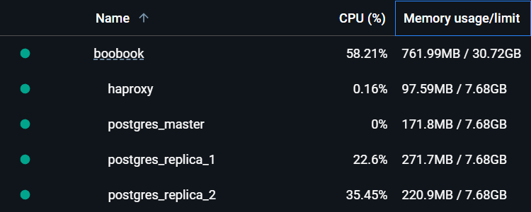

# Репликации: домашнее задание

## Выполненные шаги:

### Настройка асинхронной репликации

Было развернуто 3 PostgreSQL-узла:
- 1 мастер
- 2 слейва

Настроена потоковая репликация между мастером и слейвами.

Перенесены два запроса на чтение:
/user/get/{id}
/user/search
Чтение данных для этих запросов теперь осуществляется со слейвов, разгружая мастер-узел.

### Нагрузочное тестирование (до и после настройки репликации)

Проведено нагрузочное тестирование запросов /user/get/{id} и /user/search:

**До репликации:** Все запросы обрабатывались мастером.  
**После репликации:** Запросы на чтение перенаправлены на слейвы.

После появления репликации нагрузка на мастер-узел снизилась:

### Настройка кворумной синхронной репликации
Для повышения отказоустойчивости и обеспечения консистентности данных настроена кворумная синхронная репликация.

Протестирована запись данных в тестовую таблицу:  
На стороне клиента считалось количество успешно записанных строк.

### Проверка отказоустойчивости
В процессе тестирования была искусственно создана ситуация отказа одной из реплик (команды kill -9 и docker stop):

Нагрузка на запись продолжалась до завершения теста.

После остановки одной из реплик:  
Определен самый свежий слейв.  
Этот слейв был промоутирован до мастера.  
Второй слейв был переключен на новый мастер.

Проверка потерь транзакций:  
Все записанные строки были успешно зафиксированы. Потери транзакций не зафиксировано, что подтвердило корректную работу кворумной синхронной репликации.